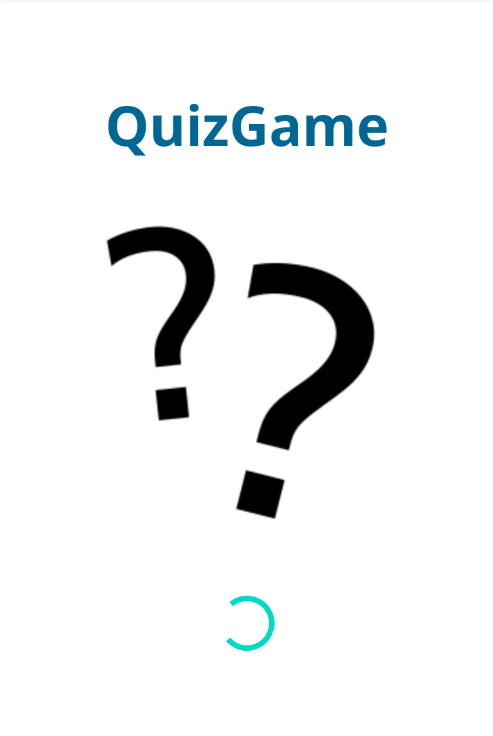
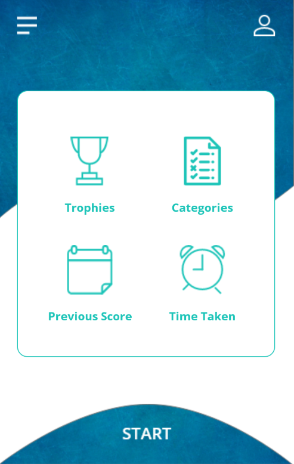
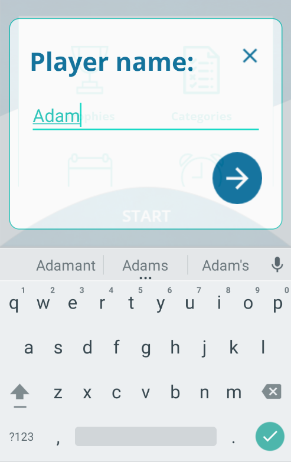
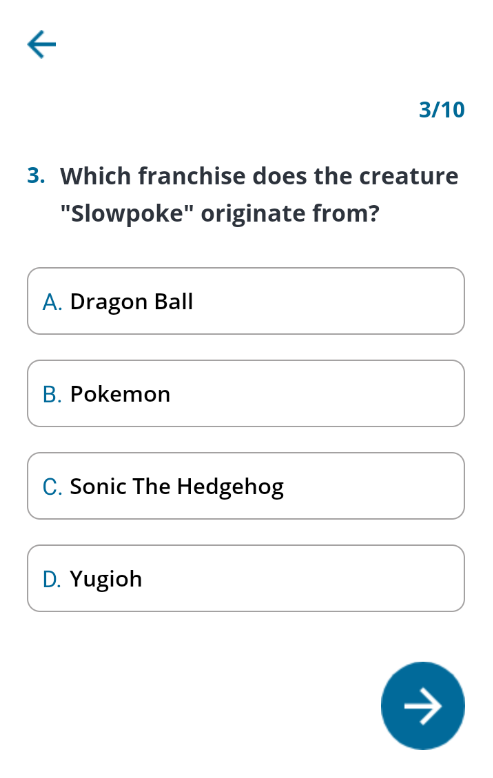
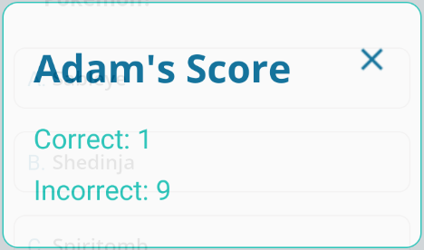

# QuizGame #

A very simple quiz game made in Kotlin.

The game takes a random set of questions from the [Open Trivia Database](https://opentdb.com/) and
lets the player have a go at them. Each player's score is saved and thus players can easily
compare and compete.

